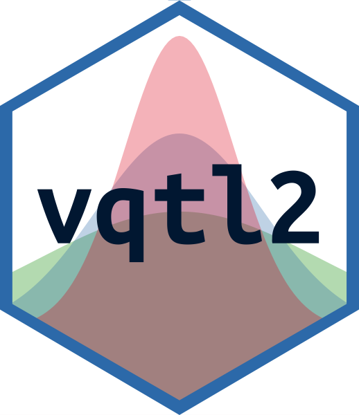

<!-- README.md is generated from README.Rmd. Please edit that file -->

```{r setup, include = FALSE}
knitr::opts_chunk$set(
  collapse = TRUE,
  comment = "#>",
  fig.path = "man/figures/README-",
  out.width = "100%"
)
```

# vqtl2 <a href='https://github.com/rcorty/vqtl2'></a>

[](https://travis-ci.org/rcorty/vqtl2)
[](https://codecov.io/github/rcorty/vqtl2?branch=master)

## Overview

vqtl2 is a drop-in extension of qtl2, providing the functions to accommodate variance heterogeneity arising from background factors and detect vQTL, as described in the literature:

* [QTL Mapping on a Background of Variance Heterogeneity](http://www.g3journal.org/content/8/12/3767)
* [Mean-Variance QTL Mapping Identifies Novel QTL for Circadian Activity and Exploratory Behavior in Mice](http://www.g3journal.org/content/8/12/3783)
* [vqtl: an R package for Mean-Variance QTL Mapping (version 1)](http://www.g3journal.org/content/8/12/3757)

The central functions of package `vqtl2` are:

* `scan1var()` conducts a genome scan
* `scan1var_perm()` conducts permutations to assess the statistical significance of findings
* `mean_var_plot()` plots the genetic and non-genetic effects at a given locus

These all inter-operate with package `qtl` and follow most of the same paradigms.

If you are new to QTL mapping, the best place to start is the
[Karl Broman's website](https://kbroman.org/).

## Installation

I plan to put `vqtl2` on CRAN, but until then, the easiest way to get `vqtl2` is from github.
The easiest way to download and install an R package from github is with the devtools package, which is available on CRAN.
Here's the `R` code to do that:
```{r, eval = FALSE}
install.packages('devtools')
devtools::install_github(repo = 'rcorty/vqtl2')
```

## Usage

```{r, message = FALSE}
library(vqtl2)
# todo
```

## Getting help

If you encounter a bug, please post a minimal reproducible example on [the github issues page](https://github.com/rcorty/vqtl2/issues).
For notes on how to produce a minimal reproducible example, check out [this StackOverflow post](https://stackoverflow.com/questions/5963269/how-to-make-a-great-r-reproducible-example?answertab=votes#tab-top).

---
Please note that the 'vqtl2' project is released with a [Contributor Code of Conduct](CODE_OF_CONDUCT.md).
By contributing to this project, you agree to abide by its terms.
