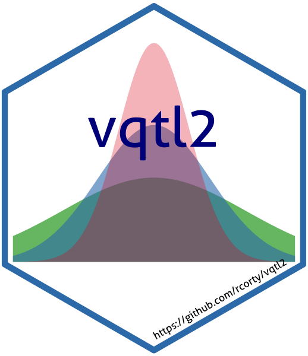

<!-- README.md is generated from README.Rmd. Please edit that file -->

# vqtl2 <a href='https://github.com/rcorty/vqtl2'></a>

[](https://travis-ci.org/rcorty/vqtl2)
[](https://codecov.io/github/rcorty/vqtl2?branch=master)

## Overview

vqtl2 is a drop-in extension of qtl2, providing the functions to
accommodate variance heterogeneity arising from background factors and
detect vQTL, as described in the literature:

  - [QTL Mapping on a Background of Variance
    Heterogeneity](http://www.g3journal.org/content/8/12/3767)
  - [Mean-Variance QTL Mapping Identifies Novel QTL for Circadian
    Activity and Exploratory Behavior in
    Mice](http://www.g3journal.org/content/8/12/3783)
  - [vqtl: an R package for Mean-Variance QTL Mapping
    (version 1)](http://www.g3journal.org/content/8/12/3757)

The central functions of package `vqtl2` are:

  - `scan1var()` conducts a genome scan
  - `scan1var_perm()` conducts permutations to assess the statistical
    significance of findings
  - `mean_var_plot()` plots the genetic and non-genetic effects at a
    given locus

These all inter-operate with package `qtl` and follow most of the same
paradigms.

If you are new to QTL mapping, the best place to start is the [Karl
Broman’s website](https://kbroman.org/).

## Installation

``` r
# The easiest way to get vqtl2 currently is from github.
# You'll need to download the `devtools` package
install.packages('devtools')
devtools::install_github(repo = 'rcorty/vqtl2')
```

<!-- ### Development version -->

<!-- To get a bug fix, or use a feature from the development version, you can install -->

<!-- dplyr from GitHub. -->

<!-- ```{r, eval = FALSE} -->

<!-- # install.packages("devtools") -->

<!-- devtools::install_github("tidyverse/dplyr") -->

<!-- ``` -->

<!-- ## Cheatsheet -->

<!-- <a href="https://github.com/rstudio/cheatsheets/blob/master/data-transformation.pdf"></a> -->

<!-- ## Usage -->

<!-- ```{r, message = FALSE} -->

<!-- library(dplyr) -->

<!-- starwars %>% -->

<!--   filter(species == "Droid") -->

<!-- starwars %>% -->

<!--   select(name, ends_with("color")) -->

<!-- starwars %>% -->

<!--   mutate(name, bmi = mass / ((height / 100)  ^ 2)) %>% -->

<!--   select(name:mass, bmi) -->

<!-- starwars %>% -->

<!--   arrange(desc(mass)) -->

<!-- starwars %>% -->

<!--   group_by(species) %>% -->

<!--   summarise( -->

<!--     n = n(), -->

<!--     mass = mean(mass, na.rm = TRUE) -->

<!--   ) %>% -->

<!--   filter(n > 1, -->

<!--          mass > 50) -->

<!-- ``` -->

<!-- ## Getting help -->

<!-- If you encounter a clear bug, please file a minimal reproducible example on [github](https://github.com/tidyverse/dplyr/issues). For questions and other discussion, please use [community.rstudio.com](https://community.rstudio.com/), or the [manipulatr mailing list](https://groups.google.com/group/manipulatr). -->

<!-- --- -->

<!-- Please note that this project is released with a [Contributor Code of Conduct](.github/CODE_OF_CONDUCT.md). -->

<!-- By participating in this project you agree to abide by its terms. -->
